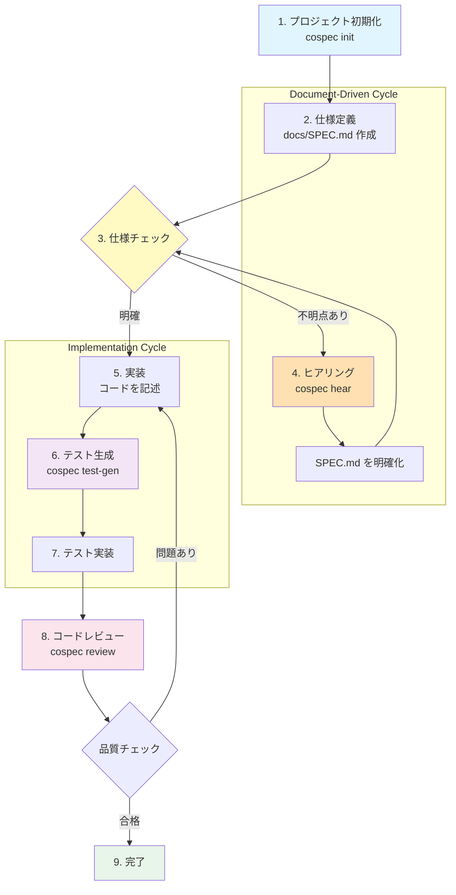

# cospec

**Collaborative Specification CLI** - 人間と AI エージェントが協力して高品質なソフトウェアを構築するプラットフォーム。

`cospec` は **"Doc-as-Context"（ドキュメントこそがコンテキスト）** と **"Consistency-First"（整合性第一）** という哲学に従います。コードが仕様を正しく反映し、明確なトレードオフ分析を通じて人間の意思決定が行われることを保証します。

## コアコンセプト

- **Codebase as Context**: ドキュメントを AI にとっての正解データ（Ground Truth）とします。
- **Consistency First**: 実装前にドキュメントとコードの不整合を排除します。
- **Decision Support**: 選択肢とメリット・デメリット（Pros/Cons）を提示し、人間の意思決定を支えます。

## 主な機能

### 実装済み
- **`cospec init`**: 推奨されるディレクトリ構造（`docs/`, `Taskfile.yml`）とガイドラインファイルを展開し、プロジェクトを初期化します。
- **`cospec review`**: 外部 AI ツール（`qwen`, `opencode` 等）を使用して、コードベースとドキュメントの整合性を分析します。
- **`cospec hear`**: プロジェクト全体のコンテキストを読み込み、`SPEC.md` のあいまいな要件を AI とともにインタラクティブに明確化するためのプロンプトを生成します。
- **`cospec test-gen`**: 仕様書からテストケースを自動生成します（Test-Driven Generation）。
- **`cospec status`**: プロジェクトの現在のフェーズと次のアクションを表示します。

## 利用ワークフロー

cospec は **Document-Driven Development（ドキュメント駆動開発）** を支援するため、以下のようなワークフローで利用されます。



### ワークフロー詳細

1. **プロジェクト初期化** (`cospec init`)
   - プロジェクト構造を初期化
   - `docs/` ディレクトリ、テンプレートファイル、ガイドラインを作成

2. **仕様定義**
   - `docs/SPEC.md` を作成・編集
   - 機能要件（FR-XXX）、ユーザー入力、期待される挙動などを記述

3. **仕様チェック**
   - SPEC.md に不明点（"任意"、"未定"、"?" など）がないか確認

4. **ヒアリング** (`cospec hear`)
    - SPEC.md の不明点を自動抽出
    - AI-Agent がインタラクティブに質問して明確化を支援
    - 仕様のあいまいさを具体的な要件に変換

5. **実装**
   - 明確な仕様に基づいて実装を進める
   - コード品質基準を守る

6. **テスト生成** (`cospec test-gen`)
   - SPEC.md からテストシナリオを自動抽出
   - pytest 形式のテストコードを生成（`tests/generated/` 配下）
   - 開発者は TODO 部分を埋めることで TDD を実践

7. **テスト実装**
   - 生成されたテストコードの TODO 部分を実装
   - テスト駆動開発により品質を担保

8. **コードレビュー** (`cospec review`)
   - AI にコード一貫性をチェックさせる
   - ドキュメント（SPEC.md）と実装の整合性を検証
   - レポートは `docs/review_YYYYMMDD_...` に保存

9. **完了**
   - 品質チェックに合格後、リリース

### ワークフローの特徴

- **Document-Driven（ドキュメント駆動）**: SPEC.md を起点として開発を進める
- **Consistency-First（整合性第一）**: あいまいな仕様は実装前に明確化
- **AI-Human Collaboration**: AI による分析・提案と人間による判断を分離
- **Test-Driven Generation**: 仕様から自動生成したテストで品質保証
- **Iterative Refinement**: レビューで問題が見つかれば、実装に戻って修正

## アーキテクチャ

`cospec` は AI-Agent のオーケストレーターとして機能します。重厚な LLM ランタイムを内包する代わりに、インストール済みの CLI ツール（AI-Agent）に処理を委譲します。

- **現在の連携先**: `Qwen` (Qwen Code), `Opencode`, `Crush`, `MistralVibe`, `Gemini-CLI`
- **コンテキスト認識**: `cospec` は関連するコンテキスト（ドキュメント + コード）を自動的に収集し、これらのツールに対して効果的なプロンプトを構築します。
- **汎用性**: AI-Agent は Qwen, Opencode の利用をサンプルとしているが、これらに限定せずプロンプトを与えてファイルを読めるAI-Agentであれば利用可能である。

## はじめに

### 前提条件

- Python 3.10 以上
- [go-task](https://taskfile.dev/) （任意ですが推奨）
- 外部ツール: 少なくとも1つのAI-Agent（例: `Qwen`, `Opencode`, `Crush` 等）がインストールされ、パスが通っていること。

### インストールとセットアップ

```bash
# リポジトリのクローン
git clone https://github.com/your-org/cospec.git
cd cospec

# 環境セットアップ（venv 作成と依存関係インストール）
task setup

# 仮想環境を有効化
source venv/bin/activate
```

### 使い方

#### 1. プロジェクトの初期化

```bash
cospec init
```
`docs/` ディレクトリと `.rules/` ディレクトリを作成し、仕様・ガイドラインのテンプレートファイル（SPEC.md, BLUEPRINT.md, Guidline*.md 等）を生成します。

#### 2. ヒアリングによる仕様明確化

```bash
# 外部ツールを使用して SPEC.md の不明点をヒアリング
cospec hear --tool Qwen

# 結果をファイルに出力
cospec hear --tool Qwen --output hearing_results.txt

# Opencode を使用
cospec hear --tool Opencode
```
AI が SPEC.md の不明点（"任意"、"未定"、"?" など）を抽出し、インタラクティブに質問します。
ユーザーの回答に基づいて SPEC.md の改善案を提案します。

#### 3. テストケースの自動生成

```bash
# SPEC.md からテストを生成（デフォルト: tests/generated/）
cospec test-gen

# カスタム出力ディレクトリを指定
cospec test-gen --output tests/custom/

# 生成されたテストファイルを検証
cospec test-gen --validate

# Qwen Code を使用して高度なテスト生成
cospec test-gen --tool Qwen
```
SPEC.md と PLAN.md からテストシナリオを自動抽出し、pytest 形式のテストコードを生成します。

#### 4. 整合性レビューの実行

```bash
# Qwen Code を使用（デフォルト）
cospec review --tool Qwen

# Opencode を使用
cospec review --tool Opencode
```
エージェントが `docs/` と `src/` ファイルを分析し、Markdown 形式のレポートを `docs/review_YYYYMMDD_...` に生成します。

#### 5. プロジェクトステータスの確認

```bash
cospec status
```
現在の開発フェーズと次のアクションを表示します。

#### 6. AI-Agent の管理

**前提条件**: レビュー機能の多様な意見を得るために、2つ以上の AI-Agent をインストールすることを推奨します。

**デフォルト設定**: `Qwen` が初期設定されています。他の AI-Agent を使用するには、環境変数 `COSPEC_DEV_TOOL`（開発用）または `COSPEC_DEFAULT_TOOL`（レビュー用）を設定するか、コマンド実行時に `--tool` オプションで指定してください。

```bash
# 登録済み AI-Agent の一覧表示
cospec agent list

# 新しい AI-Agent を追加（コマンドの --help を自動解析）
cospec agent add MistralVibe --command vibe

# AI-Agent の動作確認
cospec agent test MistralVibe
```

**ツール選択ロジック**:
- **hear, test-gen**: 環境変数 `COSPEC_DEV_TOOL` が設定されていればそれを使用、未設定なら `default_tool` を使用
- **review**: 利用しているツール以外からランダムに2つを選択してレビューを実行

**設定方法**:
- AI-Agent の設定は `.cospec/config.json` に保存されます
- 不要な AI-Agent は `.cospec/config.json` を直接編集して削除してください
- 使用可能な AI-Agent がインストール済みであることを確認してください

## 開発について

詳細な仕様については [docs/](./docs/) を、開発ガイドラインについては [.rules/](./.rules/) ディレクトリの Guidline*.md ファイルをご覧ください。


```bash
# すべてのチェックを実行（lint + type-check + test + docs:check）
task check

# 個別のチェック
task test                  # テスト実行（pytest）
task test -xvs             # 詳細出力でテスト実行
task lint                  # リンター実行（ruff check + format）
task lint-fix              # 自動修正あり
task type-check            # 型チェック（mypy）
```
## 設定

環境変数（`.env` ファイル等）を通じて `cospec` を設定できます。

| 変数名 | デフォルト | 説明 |
|----------|---------|-------------|
| `COSPEC_LANGUAGE` | `ja` | AI 応答の言語設定（`ja`, `en`）。デフォルトは日本語です。 |
| `COSPEC_DEFAULT_TOOL` | `Qwen` | レビューに使用するデフォルトツール。 |

## 👨💻 初見開発者・初回AIエージェント向けガイド

本プロジェクトで開発を行う前に、**.rules/ ディレクトリ以下の3ファイルを必ず読んでください**。

### ✅ 必須ガイド
- 開発判断の**唯一の根拠**となるガイドラインです：
1. **[`.rules/GuidlineDesign.md`](./.rules/GuidlineDesign.md)**: 設計思想（**なぜ**このルールがあるのか）
2. **[`.rules/GuidlineBasicRule.md`](./.rules/GuidlineBasicRule.md)**: 実践ルール（**どうやって**開発するか）
3. **[`.rules/GuidlineCodingTesting.md`](./.rules/GuidlineCodingTesting.md)**: コーディング思想（**どのような**コードを書くか）

### 🚀 思想 → 実践の順番で読む
- 必ず GuidlineDesign で「なぜ」を理解してから、GuidlineBasicRule で「どうやって」を確認
- `task check` 必須：実装完了後は必ず `task check` (lint + type-check + test) がパスすること
- PLAN/WorkingLog 適用: 開発の計画と履歴は PLAN.md, WorkingLog.md に記録

### 📝 実装前の確認
実装を依頼された際は、以下のプロセスを必ず踏んでください：
1. `.rules/` 3ファイルを確認
2. 要件を SPEC.md/BLUEPRINT.md と照合
3. PLAN.md にタスクを列挙して確認
4. 実装・テスト → `task check` 合格
5. WorkingLog.md に記録

### ❓ なぜこの構造？
以前は思想・ルール・実践が混在しており、AIエージェントが判断に迷うケースがありました。
`.rules/` を作成し、哲学（なぜ）・ルール（どうやって）・思想（どのような）を分離することで、一貫性ある判断を担保しています。

---

## ドキュメントファイル

### 開発用ドキュメント
- [CLAUDE.md](./CLAUDE.md): Claude Code 用プロジェクトガイド（開発ガイドライン）
- [docs/WorkingLog.md](./docs/WorkingLog.md): 開発履歴
- [docs/PLAN.md](./docs/PLAN.md): 実装計画（5 フェーズ詳細）
- [docs/CLAUDE_DIARY.md](./docs/CLAUDE_DIARY.md): 開発日誌（技術的判断と学び）

### ガイドライン
- [.rules/GuidlineDesign.md](./.rules/GuidlineDesign.md): 設計思考ガイドライン（思想・哲学）
- [.rules/GuidlineBasicRule.md](./.rules/GuidlineBasicRule.md): Human-AI協働開発の実践ワークフロー
- [.rules/GuidlineCodingTesting.md](./.rules/GuidlineCodingTesting.md): コーディングとテストガイドライン

### プロジェクト仕様
- [docs/SPEC.md](./docs/SPEC.md): プロジェクト固有の機能要件
- [docs/BLUEPRINT.md](./docs/BLUEPRINT.md): 技術的アーキテクチャ

## ライセンス

MIT