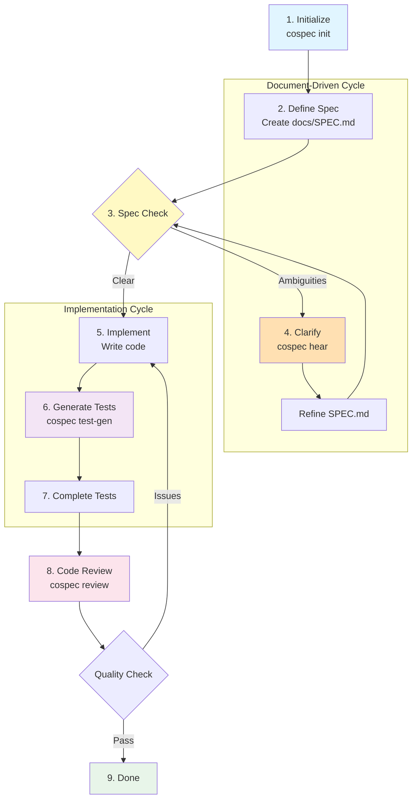

# cospec

**Collaborative Specification CLI** - A platform where humans and AI agents work together to build high-quality software.

`cospec` follows a **"Doc-as-Context"** and **"Consistency-First"** philosophy. It ensures that your code reflects your specifications and that decisions are made through clear trade-off analysis.

## Core Concepts

- **Codebase as Context**: Documentation is the ground truth.
- **Consistency First**: Eliminate discrepancies between docs and code before implementation.
- **Decision Support**: AI provides options with Pros/Cons to support human decision-making.

## Key Features

### Implemented
- **`cospec init`**: Initialize a new project with the recommended structure (`docs/`, `Taskfile.yml`) and guideline files.
- **`cospec review`**: Analyze the codebase for inconsistencies using external AI tools (e.g., `qwen`, `opencode`).
- **`cospec hear`**: Interactive hearing to resolve ambiguities in `SPEC.md`.
- **`cospec test-gen`**: Generate test cases from specifications (Test-Driven Generation).

## Development Workflow

cospec supports **Document-Driven Development (D3)** by providing tools for each phase of the development cycle.



### Workflow Overview

1. **Initialize** (`cospec init`): Set up project structure with `docs/`, templates, and guidelines.

2. **Define Specifications**: Create and edit `docs/SPEC.md` with functional requirements, user inputs, and expected behavior.

3. **Spec Check**: Identify ambiguities ("TBD", "optional", "?", etc.)

4. **Clarify** (`cospec hear`): Extract unclear points and use AI to resolve ambiguities interactively.

5. **Implement**: Code based on clear specifications.

6. **Generate Tests** (`cospec test-gen`): Extract test scenarios from SPEC.md and generate pytest-compatible test code.

7. **Complete Tests**: Implement TODO sections in generated tests for Test-Driven Development.

8. **Code Review** (`cospec review`): AI analyzes code consistency against documentation.

9. **Done**: Pass quality checks and release.

### Workflow Features

- **Document-Driven**: Start from SPEC.md as the single source of truth
- **Consistency-First**: Resolve specification ambiguities before implementation
- **AI-Human Collaboration**: AI analyzes and proposes; humans make decisions
- **Test-Driven Generation**: Auto-generated tests from specifications ensure quality
- **Iterative Refinement**: Return to implementation when review reveals issues

## Architecture

`cospec` acts as an orchestrator for AI coding agents. Instead of embedding a heavy LLM runtime, it delegates intelligence to installed CLI tools (Agentic Coding Tools).

- **Current Integrations**: `qwen` (Qwen Code), `opencode`.
- **Context Awareness**: `cospec` automatically gathers relevant context (Docs + Code) to construct effective prompts for these tools.

## Getting Started

### Prerequisites

- Python 3.10+
- [go-task](https://taskfile.dev/) (optional, but recommended)
- External Tools: Ensure `qwen` or `opencode` is installed and available in your PATH.

### Installation & Setup

```bash
# Clone the repository
git clone https://github.com/your-org/cospec.git
cd cospec

# Setup environment (creates venv and installs dependencies)
task setup
```

### Getting Started

本プロジェクトは「Codebase as Context」哲学に基づくHuman-AI協働開発を行います。
初見の開発者やAIエージェントは、以下の**必須ガイド**を先にお読みください。

#### For New Developers & First-Time AI Agents

**Required Reading:** `.rules/` ディレクトリ以下の3ファイルを**必ず読んでください**。
These are the **sole reference** for all development decisions：

1. **[`.rules/OverviewDesignThinking.md`](./.rules/OverviewDesignThinking.md)** - 設計思想（**Why** the rules exist）
2. **[`.rules/OverviewBasicRule.md`](./.rules/OverviewBasicRule.md)** - 実践ルール（**How** to develop）
3. **[`.rules/OverviewCodingTestingThinking.md`](./.rules/OverviewCodingTestingThinking.md)** - コーディング思想（**What** kind of code to write）

**Development Process:**
1. Read `.rules/` 3 files
2. Match requirements against SPEC.md/BLUEPRINT.md
3. List tasks in PLAN.md and confirm
4. Implement & test → Pass `task check`
5. Record in WorkingLog.md

**Why This Structure?**
Previously, philosophy, rules, and practices were mixed in overview files, causing confusion.
By creating `.rules/` and separating philosophy (why), rules (how), and guidelines (what), we ensure consistent decision-making.

---

### Usage

#### 1. Initialize a Project
```bash
cospec init
```
This creates a `docs/` directory and `.rules/` directory with templates for specifications and guidelines (SPEC.md, BLUEPRINT.md, Overview*.md).

#### 2. Clarify Ambiguous Requirements
```bash
# Use external tool to interactively clarify unclear points in SPEC.md
cospec hear --tool qwen

# Output results to a file
cospec hear --tool qwen --output hearing_results.txt

# Use OpenCode
cospec hear --tool opencode
```
The AI extracts unclear points (e.g., "optional", "undecided", "?") from SPEC.md and guides you through interactive clarification.

#### 3. Generate Test Cases
```bash
# Generate tests from SPEC.md (default: tests/generated/)
cospec test-gen

# Specify custom output directory
cospec test-gen --output tests/custom/

# Validate generated test files
cospec test-gen --validate

# Use Qwen Code for advanced test generation
cospec test-gen --tool qwen
```
Extracts test scenarios from SPEC.md and PLAN.md, then generates pytest-compatible test code.

#### 4. Review Code Consistency
```bash
# Use Qwen Code (default)
cospec review --tool qwen

# Use OpenCode
cospec review --tool opencode
```
The agent will analyze your `docs/` and `src/` files and generate a Markdown report in `docs/review_YYYYMMDD_...`.

#### 5. Check Project Status
```bash
cospec status
```
Displays current development phase and next actions.

## Configuration

You can configure `cospec` via environment variables (e.g., `.env` file).

| Variable | Default | Description |
|----------|---------|-------------|
| `COSPEC_LANGUAGE` | `ja` | Language for AI responses (`ja`, `en`). |
| `COSPEC_DEFAULT_TOOL` | `qwen` | Default tool to use for review. |

## Development

See [GEMINI.md](./GEMINI.md) for agent instructions and [docs/](./docs/) for detailed specifications.

- `task test`: Run tests
- `task lint`: Run linters
- `task check`: Run all checks

## License

MIT